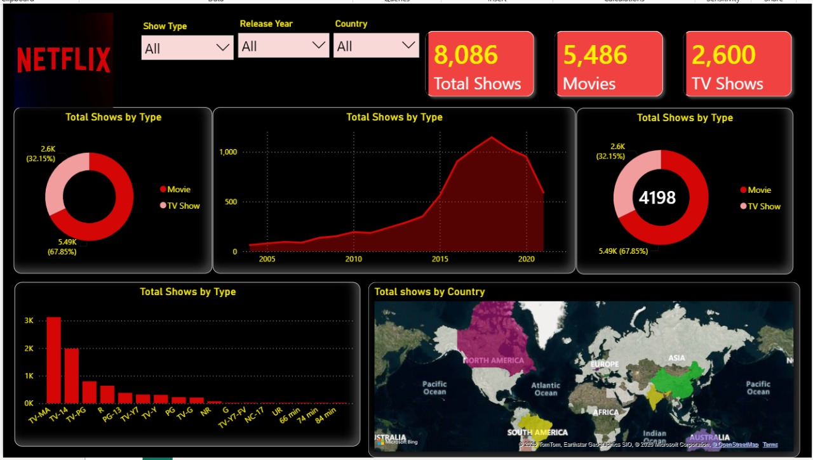

 *Netflix Content Analytics Dashboard — Power BI*

  

  <b>Interactive Business Intelligence dashboard built with Power BI to analyze Netflix content across type, time, ratings, countries, and director coverage.</b>

  
  
  
  

Building headline metrics for fast business understanding

Interactive Reporting

Slicers and cross-filtering across visuals

Data Visualization

Donut, area, column and filled-map visual design

Geospatial Analysis

Country-level content distribution

Business Storytelling

Converting a raw content dataset into an easy-to-read analytical story

Dashboard UI/UX

Dark theme, visual hierarchy, KPI-first layout and consistent formatting

Analytical Thinking

Translating dataset fields into business questions and insights

 *Project Objective*

The goal of this project is to turn a raw Netflix titles dataset into an interactive analytical dashboard that helps users quickly understand the structure and evolution of the Netflix catalog.

The dashboard answers questions such as:

What is the balance between Movies and TV Shows?

How does Netflix content vary across release years?

Which ratings occur most frequently?

How is content distributed across countries?

How much director information is available across content types?

How do the metrics change when the user filters by Show Type, Release Year, or Country?

This project focuses on both technical Power BI skills and business-oriented data storytelling.

📌 Dashboard Snapshot

The current dashboard view displays:

KPI

Dashboard value

🎞️ Total Shows            8,086

🎬 Movies                 5,486

📺 TV Shows               2,600

 Director-linked records

4,198
Content Mix

Movies: 67.85%

TV Shows: 32.15%

The dashboard therefore shows a clearly movie-heavy catalog in its current view.

🔄 End-to-End Analytics Workflow

Netflix Titles Dataset
        │
        ▼
   Data Import
        │
        ▼
 Power Query / M
        │
        ├── Cleaning
        ├── Data-type preparation
        ├── Blank / categorical handling
        ├── Country preparation
        └── Director preparation
        │
        ▼
  Cleaned Dataset
        │
        ▼
    DAX Measures
        │
        ├── Total Shows
        ├── Movies
        ├── TV Shows
        └── Director metric
        │
        ▼
 Interactive Visual Layer
        │
        ├── KPI Cards
        ├── Donut Charts
        ├── Area Chart
        ├── Rating Column Chart
        ├── Filled Map
        └── Slicers
        │
        ▼
 Business Insights

📂 Dataset Understanding

The repository contains the Netflix titles dataset with fields including:

Field                                   Purpose

show_id                                Unique title identifier

type                                   Movie or TV Show

title                                  Content title

director                               Director information

cast                                   Cast information

country                                Country/countries associated with the title

date_added                             Date the title was added

release_year                           Original release year

rating                                 Content rating

duration                              Movie runtime or number of TV seasons

listed_in                             Genre/category information

description                           Title description

The PBIX model also uses prepared fields such as Country_new and Director_new for reporting.

**Data Preparation & Power Query / M Understanding**

Power Query acts as the data-preparation layer between the raw CSV and the analytical report.

Why Power Query?

Raw data is rarely ready for direct reporting. Before visualization, the data needs to be made consistent, usable and analysis-friendly.

Main preparation responsibilities in this project

Validate and prepare column data types

Handle blank or incomplete categorical values

Prepare country information for geographic analysis

Prepare director information for analysis

Create cleaned fields used by report visuals

Keep the final reporting layer easier to analyze

Important fields created/used by the report

Country
   ↓
Country_new
   ↓
Filled Map

Director
   ↓
Director_new
   ↓
Director Analysis

Power Query mental model

Raw Data
   ↓
Transform
   ↓
Clean
   ↓
Shape
   ↓
Load

Power Query is therefore responsible for preparing the data, while Power BI's visual and DAX layers are responsible for analysis and presentation.

**DAX & Measurement Layer**

DAX provides the calculation layer used to turn the dataset into report-level KPIs and analytical metrics.

Measures visible in the PBIX report

Total Shows

Movies

TV Shows

Total director

Several chart visuals also use a non-blank count of show_id as the title-count aggregation.

DAX concepts demonstrated

Measure
   ↓
Filter Context
   ↓
Aggregation / Conditional Logic
   ↓
KPI or Visual

Why measures instead of hard-coded numbers?

Because measures respond to the current filter context.

For example:

Select "Movie"
      ↓
Movies KPI updates
      ↓
Donut updates
      ↓
Release trend updates
      ↓
Ratings update
      ↓
Country analysis updates

This is what makes the report dynamic rather than static.

***Dashboard Visualizations***

**KPI Cards — Executive Overview**

The top section provides immediate headline metrics:

Total Shows

Movies

TV Shows

Director-linked records

Why this visual?

KPI cards answer the first question a stakeholder usually has:

"What is the current size and composition of the catalog?"

They create a strong executive-summary layer before the user explores detailed charts.

**Movie vs TV Show — Donut Chart**

Category: type
Metric: title count

What it shows

The visualization compares:

Movies

TV Shows

Current dashboard understanding

Movies     █████████████████  67.85%
TV Shows   ████████           32.15%

This immediately communicates that Movies form the larger share of the displayed catalog.

Analytical purpose

Useful for understanding:

Content mix

Format preference

How the catalog composition changes under filters

**Release-Year Trend — Area Chart**

X-axis: release_year
Y-axis: title count

What it shows

The area chart tracks how many titles belong to each release year.

Key visual pattern

The dashboard shows a relatively low level in older years followed by a strong increase through the 2010s, with the highest concentration appearing in the late-2010s portion of the chart.

Business question

"How has the composition of the Netflix catalog changed over time?"

Why an area chart?

Because the objective is to communicate trend + volume over time rather than compare isolated categories.

**Rating Distribution — Column Chart**

X-axis: rating
Y-axis: title count

What it shows

The column chart compares title volume across content-rating categories.

Current dashboard understanding

The chart visually indicates that TV-MA is the largest rating category, followed by TV-14, with other ratings contributing smaller volumes.

Business questions

Which ratings dominate the catalog?

How does the rating distribution change by content type?

How does the mix change for a selected country or year?

 **Country Distribution — Filled Map**
 

Geographic field: Country_new

What it shows

The filled map provides a geographic view of where Netflix titles are represented across countries.

Why a map?

A geographic visual makes spatial patterns much easier to understand than a long country list.

Business questions

Which markets have the strongest content representation?

How does country distribution change when filtering the report?

6. 🎥 Director Analysis — Donut / Metric Layer

The PBIX includes a director-focused visual using the cleaned Director_new field.

This layer helps compare the availability of director information across content types.

Important interpretation

The displayed metric is a count of non-blank director-linked records, so it should not automatically be described as the number of unique directors.

That distinction is important in an interview because:

Count of director records ≠ Count of unique directors

 **Interactive Slicers**
 

The dashboard contains three primary slicers:

Show Type

All
Movie
TV Show

Release Year

Allows the user to focus the dashboard on a selected year.

Country

Allows the user to focus the report on a selected country.

Why slicers matter

They turn the dashboard into an exploration tool.

Instead of creating a separate report for every business question, the same visuals can be reused dynamically.

🔍 Understanding the Interactivity

The strongest analytical feature of this report is the interaction between the filters and visuals.

Example: Country Analysis

User selects a country
        ↓
Filter context changes
        ↓
KPI values recalculate
        ↓
Movie / TV mix changes
        ↓
Release-year trend changes
        ↓
Rating distribution changes
        ↓
Other visuals reflect the filtered context

Example: Movie Analysis

Select "Movie"
      ↓
Only movie records remain in context
      ↓
KPI values update
      ↓
Release trend updates
      ↓
Ratings update
      ↓
Country distribution updates

This is the difference between a dashboard and a collection of independent charts.

**Why Each Visualization Was Chosen**

Visualization                           Analytical purpose

KPI Card                               Fast executive summary

Donut Chart                            Show composition / share

Area Chart                             Time-based trend and volume

Column Chart                           Category comparison

Filled Map                             Geographic distribution

Slicer                                 User-driven filtering

The visual choices are based on the question being answered, not simply on visual variety.

💡 Key Insights From the Current Dashboard

1. Movies dominate the catalog

The current dashboard shows 5,486 Movies vs 2,600 TV Shows, giving Movies a 67.85% share.

2. Content volume is concentrated in newer release years

The release-year visualization shows a major increase during the 2010s compared with older release years.

3. TV-MA is the leading rating category

The rating chart makes TV-MA the most prominent rating in the displayed report.

4. Netflix content is geographically broad

The map demonstrates that the catalog is not concentrated in a single market; titles are represented across multiple regions.

5. Interactivity changes the story

A global summary can look very different after selecting a country, year, or content type. This makes filter-context analysis a major part of the dashboard.

These observations describe the current dashboard view and should not be interpreted as causal business conclusions about Netflix's real-world strategy.

**Dashboard Design & UX**

The report uses a dark entertainment-style theme with:

Strong red visual accents

Bright yellow analytical labels

High-contrast cards

Rounded visual containers

KPI-first hierarchy

Compact filter controls

Clear separation between summary and detailed analysis

Design philosophy

Top
│
├── Filters
├── KPIs
│
├── Main Trend / Composition Analysis
│
└── Rating + Geography
Bottom

The result is a dashboard designed for fast scanning first, deeper exploration second.

**Power BI Report Structure**

The current PBIX is a single-page 1280 × 720 report containing the main dashboard experience.

The report definition includes:

KPI cards

Movie/TV donut analysis

Director-focused analysis

Release-year area chart

Rating column chart

Country filled map

Show Type slicer

Release Year slicer

Country slicer

Netflix branding image

**How to Run the Project**

1. Clone the repository

git clone https://github.com/sonamgupta21062003-cmyk/Netflix-PowerBI-Dashboard.git

2. Open Power BI Desktop

Open:

dashboard of netflix.pbix

3. Check the data source

The repository contains:

netflix_titles.csv

If Power BI asks for a different file location, update the source path in Power Query.

 **What This Project Shows**

RAW DATA
   ↓
POWER QUERY / M
   ↓
CLEAN & SHAPE
   ↓
DAX MEASURES
   ↓
DATA MODEL
   ↓
INTERACTIVE VISUALS
   ↓
FILTER CONTEXT
   ↓
BUSINESS INSIGHTS

This project demonstrates an end-to-end Power BI analytics workflow rather than only chart creation.

🔗 Repository

GitHub:
https://github.com/sonamgupta21062003-cmyk/Netflix-PowerBI-Dashboard

LinkedIn:
https://www.linkedin.com/in/sonam-gupta-a5a9b640/

👩‍💻 Author

Sonam Gupta

Student of Computer Science
Aspiring Data Analyst | Power BI | SQL | Python | Machine Learning

  <b>📊 Transforming raw data into clear, interactive business insights.</b>

